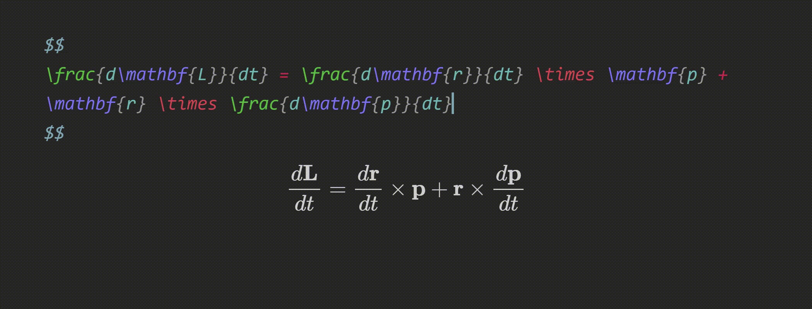

# Documentation
## Snippets
Snippets are formatted as follows:

```typescript
{trigger: string, replacement: string, options: string, description?: string, priority?: number}
```

- `trigger` : The text that triggers this snippet.
- `replacement` : The text to replace the `trigger` with.
- `options` : See below.
- `priority` (optional): This snippet's priority. Snippets with higher priority are run first. Can be negative. Defaults to 0.
- `description` (optional): A description for this snippet.


### Options
- `m` : Math mode. Only run this snippet inside math
- `t` : Text mode. Only run this snippet outside math
- `A` : Auto. Expand this snippet as soon as the trigger is typed. If omitted, the <kbd>Tab</kbd> key must be pressed to expand the snippet
- `r` : Regex. The `trigger` will be treated as a regular expression
- `w` : Word boundary. Only run this snippet when the trigger is preceded by (and followed by) a word delimiter, such as `.`, `,`, or `-`.

Multiple options can be used at once.


### Tabstops
- Insert tabstops for the cursor to jump to using `$X`, where X is a number starting from 0.
- Pressing <kbd>Tab</kbd> will move the cursor to the next tabstop.
- Tabstops can have placeholders. Use the format `${X:text}`, where `text` is the text that will be selected by the cursor on moving to this tabstop.
- Tabstops with the same number, X, will all be selected at the same time.

#### Examples
```typescript
{trigger: "//", replacement: "\\frac{$0}{$1}$2", options: "mA"}

{trigger: "dint", replacement: "\\int_{${0:0}}^{${1:\\infty}} $2 d${3:x}", options: "mA"}

{trigger: "outp", replacement: "\\ket{${0:\\psi}} \\bra{${0:\\psi}} $1", options: "mA"}
```


### Regex
- Use the `r` option to create a regex snippet.
- In the `trigger`, surround an expression with brackets `()` to create a capturing group.
- Inside the `replacement` string, strings of the form `[[X]]` will be replaced by matches in increasing order of X, starting from 0.


> ❗ **Warnings**
> - Some characters, such as `\`, `+`, and `.`, are special characters in regex. If you want to use these literally, remember to escape them by inserting two backslashes (`\\`) before them!
>   - (One backslash to escape the special character, and another to escape that backslash)
> - [Lookbehind regex is not supported on iOS.](https://github.com/bicarlsen/obsidian_image_caption/issues/4#issuecomment-982982629) Using lookbehind regex will cause snippets to break on iOS.

#### Example
The snippet
```typescript
{trigger: "([A-Za-z])(\\d)", replacement: "[[0]]_{[[1]]}", options: "rA"}
```
will expand `x2` to `x_{2}`.


### Variables
The following variables are available for use in a `trigger` or `replacement`:

- `${VISUAL}` : Can be inserted in a `replacement`. When the snippet is expanded, "${VISUAL}" is replaced with the current selection.
	- Visual snippets will not expand unless text is selected.

#### Examples



- `${GREEK}` : Can be inserted in a `trigger`. Shorthand for the following:

```
alpha|beta|gamma|Gamma|delta|Delta|epsilon|varepsilon|zeta|eta|theta|Theta|iota|kappa|lambda|Lambda|mu|nu|xi|Xi|pi|Pi|rho|sigma|Sigma|tau|upsilon|phi|Phi|chi|psi|Psi|omega|Omega
```

Recommended for use with the regex option "r".

- `${SYMBOL}` : Can be inserted in a `trigger`. Shorthand for the following:

```
hbar|ell|nabla|infty|dots|leftrightarrow|mapsto|setminus|mid|cap|cup|land|lor|subseteq|subset|implies|impliedby|iff|exists|equiv|square|neq|geq|leq|gg|ll|sim|simeq|approx|propto|cdot|oplus|otimes|times|star|perp|det|exp|ln|log|partial
```

Recommended for use with the regex option "r".

- `${SHORT_SYMBOL}` : Can be inserted in a `trigger`. Shorthand for the following:

```
to|pm|mp
```

Recommended for use with the regex option "r".