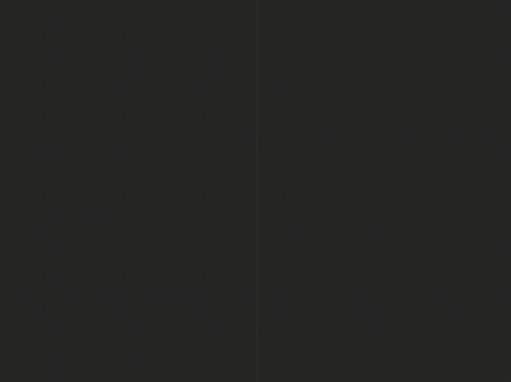

# Obsidian Latex Suite
A plugin for Obsidian that aims to make typesetting LaTeX as fast as handwriting.

Inspired by [Gilles Castel's setup](https://castel.dev/post/lecture-notes-1/) using UltiSnips.


## Features
- Snippets
	- Tabstops
	- Regex
	- Options
- Multiple cursor support
- Auto-fraction
- Matrix shortcuts
- Auto-enlarge brackets
- Tabout
- Editor commands

You can switch features on/off in settings.
The plugin comes with a [set of default snippets](https://github.com/artisticat1/obsidian-latex-suite/blob/main/src/default_snippets.ts), loosely based on [Gilles Castel's](https://castel.dev/post/lecture-notes-1/#other-snippets), that can be customised or removed in settings.


## Documentation
### Snippets
Snippets are formatted as follows:

```typescript
{trigger: string, replacement: string, options: string, description?: string, priority?: number}
```

- `trigger` : The text that triggers this snippet.
- `replacement` : The text to replace the `trigger` with.
- `options` : See below.
- `priority` (optional): This snippet's priority. Snippets with higher priority are run first. Can be negative. Defaults to 0.
- `description` (optional): A description for this snippet.


#### Options
- `m` : Math mode. Only run this snippet inside math
- `t` : Text mode. Only run this snippet outside math
- `A` : Auto. Expand this snippet as soon as the trigger is typed. If omitted, the `Tab` key must be pressed to expand the snippet
- `r` : Regex. The `trigger` will be treated as a regular expression

Multiple options can be used at once.


#### Regex
- Use the `r` option to create a regex snippet.
- In the `trigger`, surround an expression with brackets `()` to create a capturing group.
- Inside the `replacement` string, strings of the form `[[X]]` will be replaced by matches in increasing order of X, starting from 0.

##### Example
The snippet
```typescript
{trigger: "([A-Za-z])(\\d)", replacement: "[[0]]_{[[1]]}", options: "rA"}
```
will expand `x2` to `x_{2}`.


#### Tabstops
- Insert tabstops for the cursor to jump to using `$X`, where X is a number starting from 0.
- Pressing `Tab` will move the cursor to the next tabstop.
- A tabstop can be a selection. Use the format `${X:text}`, where `text` is the text that will be selected by the cursor on moving to this tabstop.
- Tabstops with the same number, X, will all be selected at the same time.

##### Examples
```typescript
{trigger: "//", replacement: "\\frac{$0}{$1}$2", options: "mA"}

{trigger: "dint", replacement: "\\int_{${0:0}}^{${1:\\infty}} $2 d${3:x}", options: "mA"}

{trigger: "outp", replacement: "\\ket{${0:\\psi}} \\bra{${0:\\psi}} $1", options: "mA"}
```


#### Variables
The following variables are available for use in a `trigger` or `replacement`:

- `${VISUAL}` : Can be inserted in a `replacement`. When the snippet is expanded, "${VISUAL}" is replaced with the current selection.
	- Visual snippets will not expand unless text is selected.
- `${GREEK}` : Can be inserted in a `trigger`. Shorthand for the following:

```
alpha|beta|gamma|Gamma|delta|Delta|epsilon|varepsilon|zeta|eta|theta|Theta|iota|kappa|lambda|Lambda|mu|nu|xi|Xi|pi|Pi|rho|sigma|Sigma|tau|upsilon|phi|Phi|chi|psi|Psi|omega|Omega
```

Recommended for use with the regex option "r".

- `${SYMBOL}` : Can be inserted in a `trigger`. Shorthand for the following:

```
hbar|ell|nabla
```

Recommended for use with the regex option "r".


### Auto-fraction
Converts the typed text

- `x/` → `\frac{x}{}`
- `(a + b(c + d))/` → `\frac{a + b(c + d)}{}`

and moves the cursor inside the brackets.
Once done typing the denominator, press `Tab` to exit the fraction.


### Auto-enlarge brackets
When a snippet containing "\\sum", "\\int" or "\\frac" is triggered, any enclosing brackets will be enlarged with "\\left" and "\\right".


### Matrix shortcuts
While inside a matrix, array, align, or cases environment,

- Pressing `Tab` will insert the "&" symbol
- Pressing `Enter` will insert "\\\\" and move to a new line
- Pressing `Shift + Enter` will move to the end of the next line (can be used to exit the matrix)




### Tabout
- Pressing `Tab` while the cursor is at the end of an equation will move the cursor outside the $ symbols.
- Otherwise, pressing `Tab` will advance the cursor to the next closing bracket: ), ], }, >, or |.


### Editor commands
- Box current equation – surround the equation the cursor is currently in with a box.
- Select current equation – select the equation the cursor is currently in

More to be added later.


## Acknowledgements
- [@tth05](https://github.com/tth05)'s [Obsidian Completr](https://github.com/tth05/obsidian-completr) for the basis of the tabstop code
- [Dynamic Highlights](https://github.com/nothingislost/obsidian-dynamic-highlights/blob/master/src/settings/ui.ts) for reference
- [Quick Latex for Obsidian](https://github.com/joeyuping/quick_latex_obsidian) for inspiration